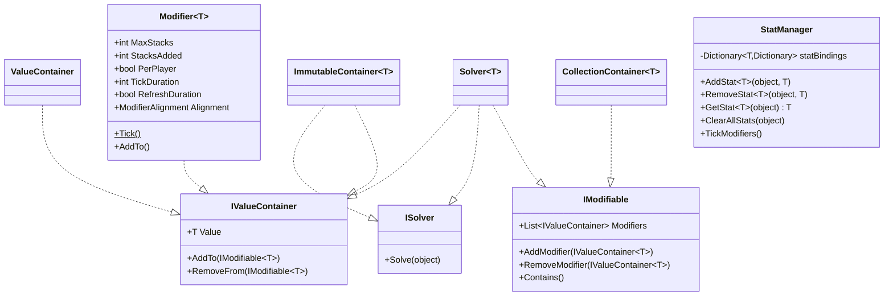

Current Stat System Architecture

```mermaid
classDiagram
    ValueContainer ..|> IValueContainer
    Solver~T~ ..|> IValueContainer
    Solver~T~ ..|> ISolver
    Solver~T~ ..|> IModifiable
    CollectionContainer~T~ ..|> IModifiable
    ImmutableContainer~T~ ..|> ISolver
    ImmutableContainer~T~ ..|> IValueContainer
    Modifier~T~ ..|> IValueContainer
    class IValueContainer~T~{
        +T Value
        +AddTo(IModifiable~T~)
        +RemoveFrom(IModifiable~T~)
    }
    class IModifiable~T~{
        +List~IValueContainer~ Modifiers
        +AddModifier(IValueContainer~T~)
        +RemoveModifier(IValueContainer~T~)
        +Contains()
    }
    class ISolver{
        +Solve(object)
    }
    class StatManager{
        -Dictionary~T,Dictionary~ statBindings
        +AddStat~T~(object, T)
        +RemoveStat~T~(object, T)
        +GetStat~T~(object) T
        +ClearAllStats(object)
        +TickModifiers()
    }
    class Modifier{
        +int MaxStacks
        +int StacksAdded
        +bool PerPlayer
        +int TickDuration
        +bool RefreshDuration
        +ModifierAlignment Alignment
        +Tick()$
        +AddTo()
    }
```
